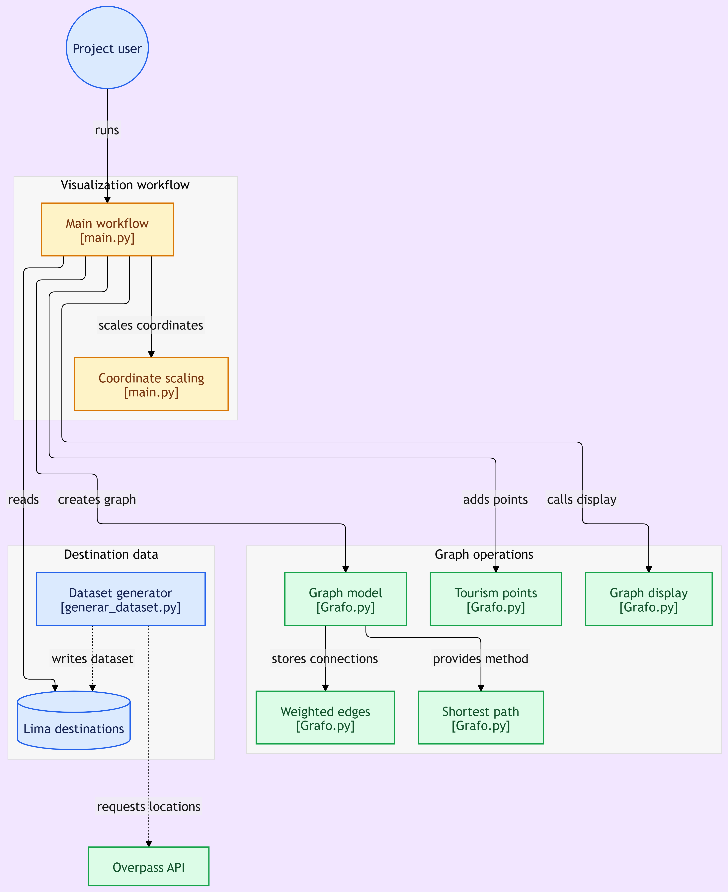

# Complejidad Algorítmica 💻 - Grupo 1

| Integrantes |
| ----------- |	
| Leon Ojeda, Adrian Alejandro |
| Huarancca Evangelista, Duval Paul |
| Quispe Serrano, Julio Frank |

## Caso del proyecto

**Caso 1: Optimización de rutas de reparto (logística urbana)**

### Aplicación real

- UPS
- Rappi

### Problema

Minimizar tiempo / costo de entregas en una ciudad.

### Algoritmos aplicables

- Fuerza Bruta → probar todas las rutas (TSP pequeño)
- Backtracking → podar rutas no óptimas
- Divide y vencerás → dividir zonas geográficas
- Grafos → modelar calles/intersecciones
- BFS/DFS → exploración básica
- Ordenamiento topológico → dependencias de entregas
- SCC → detectar zonas con alta conectividad
- UFDS → agrupar zonas
- MST → construir red base mínima
- Flujo máximo → capacidad de tráfico/logística
- Voraces → heurísticas tipo vecino más cercano
- Programación dinámica → TSP con memoización
- DP en grafos → caminos óptimos con estados

## Ensayo escrito

```
(Colocar link del Docs)
```

## Presentación

```
(Colocar link del Canva)
```

## Estructura del proyecto

```text
└── aleon30-complejidad-algoritmica/
    ├── README.md                          # Documentación del proyecto
    ├── Grafo.py                           # Implementación del grafo
    ├── main.py                            # Ejecutable principal
    ├── requirements.txt                   # Dependencias del proyecto
    └── dataset/ 
        ├── generar_dataset.py             # Generación del dataset
        └── destinos_turisticos_lima.csv   # Dataset generado
```



## Requisitos

Este proyecto está desarrollado para ejecutarse localmente con:

- Python 3.11

### Dependencias principales

| Librería | Versión recomendada | Uso dentro del proyecto |
| --- | --- | --- |
| `matplotlib` | `>= 3.10.0` | Visualización del grafo |
| `numpy` | `>= 2.4.6` | Implementación del grafo |
| `pandas` | `>= 2.2.3` | Manipulación del dataset |

### Instalación local

Se pueden instalar las dependencias usando el archivo `requirements.txt` en la terminal:

```bash
pip install -r requirements.txt
```